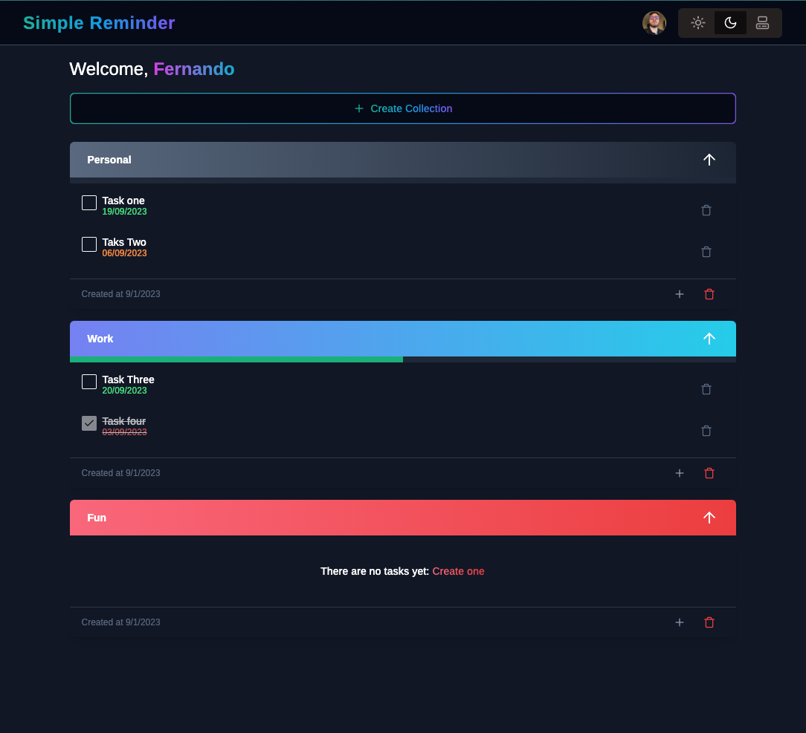

## Simple Reminders App
 

## Features
- Auth with Clerk
- Theme Switcher
- Add Collection of reminders
- Add reminders to collection
- Delete reminders
- Delete collection
- Progress bar for reminders

## Tech Stack
- NextJS (server actions)
- ReactJS
- TailwindCSS
- Clerk (Auth)
- Prisma (ORM)
- Vercel (Deployment)

## Getting Started
Create a `.env.local` file similar to `.env.example` and add your Clerk API keys and Prisma database URL.


To run the development server:

```bash
npm run dev
# or
yarn dev
# or
pnpm dev
```
